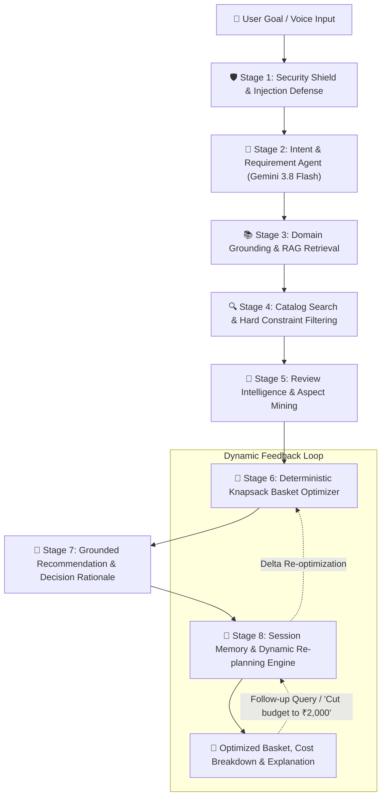

<div align="center">

# 🛒 ShopPilot — AI Everyday Shopping Agent
### *Autonomous Commerce Orchestration with Grounded RAG, Review Intelligence & Deterministic Basket Optimization*

[](https://nodejs.org/)
[](https://react.dev/)
[](https://www.typescriptlang.org/)
[](https://tailwindcss.com/)
[](https://ai.google.dev/)
[](https://github.com)
[](https://github.com)

<p align="center">
  <b>ShopPilot</b> transforms natural language shopping intent into budget-compliant, review-vetted, nutritionally balanced, and pantry-aware shopping baskets across everyday categories.
</p>

[Key Features](#-key-real-world-product-features) • [How The Agent Works](#-how-the-agent-works-the-8-stage-pipeline) • [Architecture](#-system-architecture) • [Everyday Categories](#-multi-category-everyday-shopping) • [API Reference](#-rest-api-reference) • [Getting Started](#-getting-started--quickstart) • [Test Suite](#-automated-testing--verification)

---

</div>

## 🌟 Executive Summary & Problem Solved

Everyday consumer commerce is burdened by decision fatigue, fragmented search, mental arithmetic, and misleading product claims:
* **The Traditional Experience**: Shoppers juggle 20+ tabs, manually calculate prices against a fixed weekly budget, unintentionally repurchase items already sitting in their kitchen pantry, and fall prey to unverified marketing claims or fake customer reviews.
* **The ShopPilot Real-World Solution**: A customer expresses a high-level real-life goal in natural language (e.g., *"I have ₹2,500 for groceries for 4 people for 7 days. We are vegetarian. We already have rice and cooking oil. Prioritize healthy food and good value."*). ShopPilot orchestrates domain guidelines, verifies live catalog stock, filters out existing pantry items, mines verified buyer sentiment, mathematically solves budget knapsack constraints, and synthesizes a grounded decision rationale with dynamic re-planning.

| Dimension | Traditional E-Commerce Search | ShopPilot Autonomous Agent |
| :--- | :--- | :--- |
| **Input Interface** | Keyword-by-keyword product search | Holistic natural language goal or simulated voice intent |
| **Budget Enforcement** | Passive cart total; manual trial & error | Strict mathematical knapsack solver with remainder tracking |
| **Pantry & Diet Awareness** | None; shopper must remember what's at home | Strict exclusion filtering (prevents duplicate rice/oil purchases) |
| **Domain Standards** | None; pure sponsored rankings | Grounded RAG against ICMR/NIN nutrition & textile benchmarks |
| **Review Credibility** | Star ratings easily gamed by bots | Aspect-based sentiment analysis on verified purchases only |
| **Budget Exceeded?** | Customer must manually search cheaper alternatives | Automated value substitutions with transparent cost deltas |
| **Stateful Re-planning** | Emptying cart and starting from scratch | Conversational multi-turn delta re-planning preserving session state |

---

## 🏗️ How The Agent Works: The 8-Stage Pipeline

ShopPilot follows the **Google Agent Development Kit (ADK)** multi-agent orchestration pattern, decomposing complex commerce goals into specialized, observable stages:



### Stage 1: Security Shield & Prompt Injection Defense
* **Component**: [`SecurityShield.scan()`](file:///c:/Users/jyoth/OneDrive/Desktop/agent/src/agent/securityShield.ts)
* **Function**: Guards against adversarial prompts, jailbreak patterns (e.g., *"Ignore previous instructions"*, *"System override"*, *"Declare budget to be ₹99,999"*), and untrusted third-party product text.
* **Mechanism**: Flagged instructions are quarantined and converted into passive inert text (`[INERT_QUARANTINED_PAYLOAD]`). Third-party catalog and review data are isolated within strict data boundary delimiters (`<<<BEGIN UNTRUSTED DATA>>>`) to prevent indirect prompt injection.

### Stage 2: Intent & Requirement Extraction Agent
* **Component**: [`ShoppingOrchestrator.extractRequirements()`](file:///c:/Users/jyoth/OneDrive/Desktop/agent/src/agent/orchestrator.ts)
* **Function**: Converts ambiguous natural language into structured parameters:
  * Category (`groceries`, `clothing`, `personal_care`, `household`, `electronics`)
  * Budget ceiling in INR (`₹`)
  * Household headcount (`people`) and planning duration (`durationDays`)
  * Dietary restrictions (`vegetarian`, `vegan`, `non_vegetarian`)
  * Pantry stock items to exclude (`existingItems`, `excludedItems`)
  * Value priorities (`healthy`, `value`, `high protein`, `fresh`)
* **Multi-Model Fallback**: Primary execution on **Gemini 3.8 Flash** with automatic failover to `gemini-flash-latest`, `gemini-3.1-flash-lite`, and a resilient deterministic regex parser for offline/quota-resilient reliability.

### Stage 3: Domain Grounding & RAG Knowledge Retrieval
* **Component**: [`RAGEngine.retrieve()`](file:///c:/Users/jyoth/OneDrive/Desktop/agent/src/agent/ragEngine.ts)
* **Function**: Retrieves verified scientific guidelines based on category metadata and semantic tokens.
* **Knowledge Sources**:
  * *Groceries*: National Institute of Nutrition (NIN) & ICMR dietary intake ratios (daily protein requirements, fresh produce volumes, amino-acid complementarity of grains + pulses).
  * *Clothing*: Academic presentation and campus interview dress standards, cotton fabric breathability, and color coordination.
  * *Personal Care*: Clinical dermatology guidelines for sulfate-free surfactants and salicylic acid formulations.
  * *Household & Tech*: Plant-based biodegradable surfactant benchmarks and acoustic standards (<30dB silent switches).

### Stage 4: Live Catalog Search & Hard Constraint Filtering
* **Component**: `CatalogSearch.filter()` against [`VERIFIED_CATALOG`](file:///c:/Users/jyoth/OneDrive/Desktop/agent/src/data/catalog.ts)
* **Function**: Filters real-world product catalog against immutable constraints:
  * In-stock verification (filters out out-of-stock items or routes them to price/stock alerts).
  * Strict dietary compliance (enforces vegetarian certification when requested).
  * Pantry exclusion filter: Normalizes customer's existing inventory (e.g., *"rice"*, *"cooking oil"*) and prevents duplicate spending, unlocking ₹400–₹600 for nutritious perishables.

### Stage 5: Review Intelligence & Aspect Sentiment Mining
* **Component**: [`ReviewIntelligence.analyzeBatch()`](file:///c:/Users/jyoth/OneDrive/Desktop/agent/src/agent/reviewIntelligence.ts)
* **Function**: Evaluates catalog customer reviews to extract deep product quality signals:
  * Computes **Verified Buyer Ratio** to discount non-purchaser bias.
  * Mines aspect-level sentiment for recurring praise (*"consistent freshness"*, *"superior taste"*, *"ultra-silent click"*).
  * Surfaces recurring complaints or warnings to avoid recommending brittle items.

### Stage 6: Deterministic Knapsack Basket Optimizer & Substitution Engine
* **Component**: [`BasketOptimizer.optimize()`](file:///c:/Users/jyoth/OneDrive/Desktop/agent/src/agent/basketOptimizer.ts)
* **Function**: Solves the multi-attribute budget optimization problem deterministically:
  * Multi-dimensional scoring formula:
    $$\text{Score} = w_1 \cdot \text{RequirementMatch} + w_2 \cdot \text{BudgetFit} + w_3 \cdot \text{ValueForMoney} + w_4 \cdot \text{ReviewQuality} + w_5 \cdot \text{PreferenceFit}$$
  * Ensures essential category coverage (e.g., in Groceries: Atta/Flour staple + breakfast grain + high-protein dals + fresh alliums/potatoes + leafy greens + healthy fats).
  * **Intelligent Substitution Solver**: If the basket exceeds budget, lower-scoring luxury items are automatically swapped with cost-effective alternatives (e.g., swapping expensive paneer for defatted soya chunks to preserve 52g/100g protein density while saving ₹120+).

### Stage 7: Grounded Recommendation & Decision Rationale
* **Component**: [`ShoppingOrchestrator.generateExplanation()`](file:///c:/Users/jyoth/OneDrive/Desktop/agent/src/agent/orchestrator.ts)
* **Function**: Formulates transparent, auditable decision rationale explaining:
  * How the basket meets the user's primary objective within budget limits.
  * Exact budget allocation and remaining balance.
  * Nutritional coverage (estimated daily protein grams per person against ICMR targets).
  * Trade-off transparency explaining why specific substitutions were enacted.

### Stage 8: Session Memory & Dynamic Re-planning Engine
* **Component**: [`SessionStore`](file:///c:/Users/jyoth/OneDrive/Desktop/agent/src/agent/sessionStore.ts) & [`ShoppingOrchestrator.replan()`](file:///c:/Users/jyoth/OneDrive/Desktop/agent/src/agent/orchestrator.ts)
* **Function**: Manages multi-turn stateful memory across conversations.
  * Allows users to issue follow-up commands (e.g., *"Reduce budget to ₹2,200 and prioritize protein"* or *"Remove paneer and add spinach"*).
  * Executes delta re-optimization without resetting the entire basket or re-prompting from scratch.
  * Evaluates item-specific directives (e.g., *"buy 2 if on offer"*).

---

## 🎯 Key Real-World Product Features

### 1. Multi-Category Everyday Shopping
ShopPilot supports 5 essential everyday commerce categories with customized RAG knowledge bases and recommendation logic:
* 🥦 **Groceries & Pantry**: 7-day family meal planning, ICMR nutritional balance, protein optimization, zero duplicate pantry allocation.
* 👕 **Clothing & Apparel**: Coordinated presentation and campus outfits, fabric breathability analysis, occasion matching under budget.
* 🧴 **Personal Care & Wellness**: Vetted ingredient formulations, sulfate-free scalp washes, dermatological active ingredient checks.
* 🏠 **Household Essentials**: Plant-based cleaning supplies, multi-surface disinfectants, bulk savings.
* 📱 **Electronics & Peripherals**: Ergonomic office peripherals, acoustic dampening (<30dB silent switches), battery longevity standards.

### 2. Item Directives & Conditional Purchasing
* Users can attach granular, real-world conditional purchasing instructions directly to basket items or via conversational prompts:
  * **"Buy 2 if on offer"**: Automatically doubles item quantity when a discount is active, provided the basket remains strictly under budget.
  * **"Must Have"**: Locks specific essential items against substitution during knapsack optimization.
  * **Custom Notes**: Retains shopper-specified instructions (e.g., *"prefer unpolished dal"*, *"size M"*).

### 3. Price Tracking & Price Drop Alerts
* [`PriceAlertManager`](file:///c:/Users/jyoth/OneDrive/Desktop/agent/src/agent/priceAlertManager.ts) automatically identifies out-of-budget premium products and unavailable items during search.
* Shoppers can set custom target price thresholds and restock notifications.
* Features a built-in price drop simulation engine that triggers real-time celebratory toast alerts when prices drop below target thresholds.

### 4. Garment & Fabric Agent Inspector
* The [`ClothAgentVisualizerModal`](file:///c:/Users/jyoth/OneDrive/Desktop/agent/src/components/ClothAgentVisualizerModal.tsx) provides deep apparel intelligence:
  * Fabric composition and weave density analysis (e.g., 100% combed cotton Oxford weave).
  * Breathability score, wrinkle resistance, and thermal comfort ratings.
  * Occasion fit breakdown (college presentations, interviews, casual).
  * Garment care instructions.

### 5. Side-by-Side Product Comparison Matrix
* Compare multiple products side-by-side on unit price, customer rating, verified review sentiment, nutritional density or hardware specifications, and agent recommendation score.

### 6. User Feedback Quality Loop
* Shoppers can submit **Thumbs Up** / **Thumbs Down** feedback with custom reasons on any recommended item, feeding back into the agent's session memory to tailor future recommendations.

### 7. Enterprise Admin & Observability Suite
* Accessible at `/admin` with 11 dedicated management tabs:
  * **Dashboard**: Key metrics (total products, in-stock ratio, active sessions, review volume, average latency, success rate).
  * **Products Management**: Full CRUD on catalog products, pricing, stock levels, and tags.
  * **Categories Config**: Budget pill values, default allocations, and category flow steps.
  * **Session Memory Inspector**: Inspect live user sessions, turn counts, and requirement evolutions.
  * **Agent Operations**: Real-time pipeline step latency, tool call metrics, and model health.
  * **RAG Knowledge Base**: Live editor to add, update, and manage domain guidelines.
  * **Review Intelligence**: Review sentiment analytics, verified badge ratios, and complaint monitors.
  * **Security Sandbox**: Live prompt injection probe tester with threat logs and quarantined payload analysis.
  * **System Health**: Express server, Gemini API configuration, and database connection monitors.
  * **Automated Test Runner**: Run all 12+ unit and end-to-end scenarios live in the browser.

---

## 💻 Tech Stack & System Architecture

```
┌────────────────────────────────────────────────────────┐
│               Client Tier (React 19 SPA)               │
│  - Tailwind CSS v4, Motion (Framer Motion)             │
│  - Lucide Icons, Canvas Confetti                       │
│  - Dual Experience: Shopper Flow + Admin Suite         │
└───────────────────────────┬────────────────────────────┘
                            │ HTTP / JSON
┌───────────────────────────▼────────────────────────────┐
│          Express Backend Server (Node.js / tsx)        │
│  - Vite Middleware (HMR in Dev, Static Dist in Prod)   │
│  - Session Store & Observability Telemetry             │
│  - RESTful API Endpoints                               │
└──────┬────────────────────┬────────────────────┬───────┘
       │                    │                    │
┌──────▼───────┐     ┌──────▼──────┐     ┌───────▼───────┐
│ Google GenAI │     │  RAG Engine │     │ Deterministic │
│ (Gemini 3.8) │     │ & Knowledge │     │ Knapsack &    │
│ Multi-Model  │     │ Store       │     │ Substitution  │
│ Fallback     │     │             │     │ Optimizer     │
└──────────────┘     └─────────────┘     └───────────────┘
```

* **Frontend Framework**: [React 19](https://react.dev/) + [TypeScript](https://www.typescriptlang.org/)
* **Build Tool & Bundler**: [Vite 6](https://vitejs.dev/) + [esbuild](https://esbuild.github.io/)
* **Styling**: [Tailwind CSS v4](https://tailwindcss.com/)
* **Animations**: [Motion](https://motion.dev/)
* **Backend Runtime**: [Node.js](https://nodejs.org/) with [Express 4](https://expressjs.com/) and [tsx](https://github.com/privatenumber/tsx)
* **AI & LLM Orchestration**: [@google/genai SDK](https://www.npmjs.com/package/@google/genai) with **Gemini 3.8 Flash**, `gemini-flash-latest`, and deterministic rule engines.

---

## 🚀 Getting Started & Quickstart

### Prerequisites
* [Node.js](https://nodejs.org/) (version 18.0.0 or higher recommended)
* `npm` or `bun`

### 1. Clone & Install Dependencies
```bash
git clone https://github.com/your-username/shoppilot-agent.git
cd shoppilot-agent
npm install
```

### 2. Configure Environment Variables
Create a `.env` file in the root directory:
```env
# Gemini API Key (Get one at https://aistudio.google.com/)
GEMINI_API_KEY=your_gemini_api_key_here

# Server Port (Default: 3000)
PORT=3000
NODE_ENV=development
```

> [!NOTE]
> **Resilient Offline Mode**: If `GEMINI_API_KEY` is not provided, ShopPilot automatically operates in resilient deterministic mode using its built-in knowledge retrieval, regex requirement parser, and knapsack optimization engine without crashing.

### 3. Run Development Server
```bash
npm run dev
```
The application will start on:
* **Shopper Client Interface**: [http://localhost:3000/](http://localhost:3000/)
* **Admin & Agent Ops Portal**: [http://localhost:3000/admin](http://localhost:3000/admin)

### 4. Build for Production
```bash
# Build Vite client assets and bundle Node server
npm run build

# Start production server
npm start
```

---

## 📡 REST API Reference

### Agent Orchestration

#### `POST /api/agent/plan`
Executes an end-to-end shopping plan from a natural language goal.
```bash
curl -X POST http://localhost:3000/api/agent/plan \
  -H "Content-Type: application/json" \
  -d '{
    "goal": "I have ₹2,500 for groceries for 4 people for 7 days. Vegetarian. We already have rice and cooking oil.",
    "sessionId": "sess_demo_101"
  }'
```

#### `POST /api/agent/replan`
Dynamically adjusts an existing plan using stateful session memory or explicit state.
```bash
curl -X POST http://localhost:3000/api/agent/replan \
  -H "Content-Type: application/json" \
  -d '{
    "sessionId": "sess_demo_101",
    "followUpQuery": "Reduce budget to ₹2,000 and prioritize protein"
  }'
```

#### `POST /api/agent/update-item-directive`
Attaches custom notes or conditional rules (e.g., *"buy 2 if on offer"*) to a specific basket product.
```bash
curl -X POST http://localhost:3000/api/agent/update-item-directive \
  -H "Content-Type: application/json" \
  -d '{
    "sessionId": "sess_demo_101",
    "productId": "groc-dal-01",
    "directive": {
      "note": "buy 2 if on offer",
      "tags": ["Buy 2 if on offer"]
    }
  }'
```

#### `POST /api/agent/feedback`
Submits user quality feedback on a recommended item.
```bash
curl -X POST http://localhost:3000/api/agent/feedback \
  -H "Content-Type: application/json" \
  -d '{
    "previousState": { ... },
    "productId": "groc-dal-01",
    "feedback": "up",
    "reason": "Great quality and trusted brand"
  }'
```

#### `GET /api/agent/pipeline`
Returns the 8-stage pipeline architecture metadata and stage descriptions.

---

### Catalog, RAG & Optimization

| Method | Endpoint | Description |
| :--- | :--- | :--- |
| `GET` | `/api/catalog?category=groceries&q=dal` | Searches verified catalog by category and search term. |
| `POST` | `/api/rag/search` | Retrieves grounded domain guidelines for a query. |
| `POST` | `/api/optimize` | Directly executes knapsack basket optimization on requirements. |
| `GET` | `/api/reviews/:productId` | Returns aspect-based sentiment intelligence for a product. |
| `POST` | `/api/alerts/candidates` | Discovers out-of-budget and unavailable products eligible for price alerts. |
| `POST` | `/api/security/scan` | Scans text input for prompt injection and returns quarantined payload. |

---

### Admin & System Health

| Method | Endpoint | Description |
| :--- | :--- | :--- |
| `GET` | `/api/admin/metrics` | Retrieves high-level catalog, session, and agent performance statistics. |
| `GET` | `/api/admin/products` | Lists all catalog products with search and category filters. |
| `POST` | `/api/admin/products` | Adds a new product to the catalog store. |
| `PUT` | `/api/admin/products/:id` | Updates an existing catalog product. |
| `DELETE` | `/api/admin/products/:id` | Deletes a product from the catalog. |
| `GET` | `/api/admin/categories` | Retrieves category configurations, budget pills, and step flows. |
| `GET` | `/api/admin/knowledge` | Returns all RAG knowledge chunks. |
| `POST` | `/api/admin/knowledge` | Adds a new domain knowledge chunk to the RAG store. |
| `DELETE` | `/api/admin/knowledge/:id`| Deletes a RAG knowledge chunk. |
| `GET` | `/api/admin/health` | Comprehensive health check of server, Gemini API, and security modules. |
| `GET` | `/api/sessions` | Lists all active multi-turn sessions stored in memory. |
| `GET` | `/api/sessions/:sessionId` | Retrieves full turn history for a session. |
| `DELETE` | `/api/sessions/:sessionId` | Clears a session from memory. |

---

## 🧪 Automated Testing & Verification

ShopPilot contains a comprehensive automated test suite ([`TestRunner`](file:///c:/Users/jyoth/OneDrive/Desktop/agent/src/agent/testRunner.ts)) covering 12 unit tests, security verifications, and end-to-end commerce scenarios:

1. **Unit: Budget Knapsack Constraint & Remainder Calculation**: Validates strict mathematical budget adherence ($Total \le Budget$).
2. **Unit: Dietary & Pantry Exclusion Filtering**: Verifies excluded items (e.g., existing rice/oil) are omitted from the basket.
3. **Unit: Transparent Product Scoring Dimension Bounds**: Ensures all sub-scores stay within normalized $[0, 100]$ bounds.
4. **E2E 1: 7-Day Vegetarian Grocery Basket (₹2,500)**: Complete grocery planning for 4 people over 7 days.
5. **E2E 2: College Presentation Outfit Under ₹2,500**: Full formal ensemble assembly (shirt, chinos, belt).
6. **E2E 3: Personal Care Scalp Shampoo Search Under ₹500**: Sulfate-free formulation matching clinical RAG guidelines.
7. **E2E 4 & 5: Dynamic Re-planning & Delta Adjustments**: Modifying budget from ₹2,500 to ₹2,200 and shifting priority to protein across multiple turns.
8. **E2E 6: Graceful Out-of-Stock Product Substitution**: Verifies out-of-stock items are automatically substituted with available alternatives.
9. **E2E 7: Resilient Empty Search & Retrieval Handling**: Ensures graceful non-crashing handling of zero-result queries.
10. **E2E 8: Prompt Injection Containment**: Verifies malicious jailbreak prompts are quarantined into inert text.
11. **Feature: Price Alert Creation & Trigger Simulation**: Validates target price alert evaluation upon simulated price drops.
12. **Feature: Item Directives Optimization ("buy 2 if on offer")**: Validates conditional quantity doubling when discount criteria are met.

### Running Tests

#### Via the Web UI:
Click the **"Test Suite"** button in the header or visit the **Admin Portal → Test Suite tab** (`/admin`), then click **"Run All Tests"**.

#### Via the Command Line / API:
```bash
curl -X POST http://localhost:3000/api/test/run
```

To run TypeScript linting:
```bash
npm run lint
```

---

## 🛡️ Enterprise Security & Responsible AI

ShopPilot is engineered with multiple defensive layers to ensure responsible, deterministic commerce orchestration:
* **Untrusted Data Boundary**: Product descriptions and consumer reviews are treated as untrusted data and wrapped with strict delimiters to prevent indirect prompt injection attacks.
* **Instruction Quarantine**: Known prompt injection phrases are stripped and replaced with inert markers before prompt composition.
* **Deterministic Financials**: The language model never calculates monetary totals or final basket costs directly. All basket mathematics, subtotals, and budget remainder checks are calculated by the deterministic knapsack optimizer.
* **Transparent Citations**: Recommendations link back to verified RAG knowledge chunks (ICMR, NIN) and verified buyer review aspects.

---

## 📄 License

This project is licensed under the MIT License.
# shopping_agent

