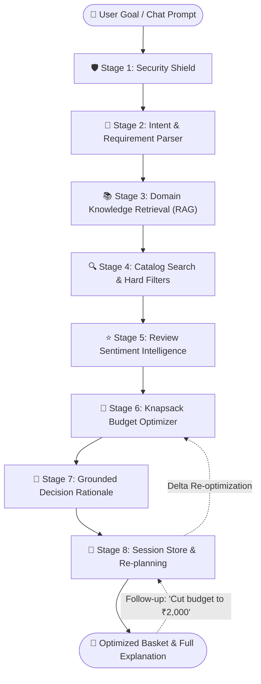

<div align="center">

# 🛒 ShopPilot — AI Everyday Shopping Agent
### *Your intelligent shopping assistant that plans baskets, respects your exact budget, avoids duplicate pantry purchases, and explains every choice.*

[](https://nodejs.org/)
[](https://react.dev/)
[](https://www.typescriptlang.org/)
[](https://tailwindcss.com/)
[](https://ai.google.dev/)
[](https://opensource.org/licenses/MIT)

<p align="center">
  <b>ShopPilot</b> turns everyday shopping goals into budget-compliant, review-vetted, nutritionally balanced, and pantry-aware shopping baskets across groceries, clothing, personal care, household essentials, and tech.
</p>

[✨ Quick Overview](#-what-is-shoppilot) • [💡 Why ShopPilot?](#-the-problem--the-shoppilot-solution) • [🎯 Key Features](#-key-features) • [🔄 How It Works](#-how-the-agent-works-8-stage-pipeline) • [🚀 Quickstart](#-getting-started--quickstart) • [📁 Project Structure](#-project-structure) • [📡 API Reference](#-rest-api-reference) • [🧪 Automated Tests](#-automated-testing)

---

</div>

## ✨ What is ShopPilot?

Imagine being able to tell a shopping assistant:

> *"I have ₹2,500 to buy groceries for a family of 4 for the next 7 days. We are vegetarian. We already have rice and cooking oil at home. Please get healthy food with good protein."*

In seconds, **ShopPilot**:
1. **Understands your constraints**: Extracts your budget (₹2,500), family size (4), duration (7 days), and diet (vegetarian).
2. **Checks your pantry**: Skips rice and cooking oil so you don't spend money on items already sitting in your kitchen.
3. **Retrieves domain guidelines**: Uses grounded nutrition standards (ICMR/NIN guidelines) for optimal daily protein and fresh produce.
4. **Vets real products**: Evaluates verified buyer reviews to filter out low-quality or misleading products.
5. **Solves the budget mathematically**: Uses a deterministic knapsack solver to fill your basket under budget down to the rupee. If costs are too high, it automatically recommends smarter value substitutions (like high-protein soya chunks instead of expensive paneer).
6. **Explains every decision**: Provides a clear, transparent rationale for why each item was selected.
7. **Supports live conversation**: Want to change something? Just say *"Cut budget to ₹2,000"* or *"Remove oats and add spinach"* — ShopPilot re-balances your basket on the fly!

---

## 💡 The Problem & The ShopPilot Solution

Everyday shopping online causes **decision fatigue**, constant tab-switching, and accidental overspending:

| Challenge | Traditional E-Commerce Search | ShopPilot Autonomous Agent |
| :--- | :--- | :--- |
| **How you search** | Typing one item at a time across 20 browser tabs | Speak or type your entire goal in plain English |
| **Budget limits** | You calculate cart totals manually; trial & error | Mathematical guarantee: never exceeds your budget |
| **Pantry awareness** | None; shoppers constantly repurchase duplicate staples | Automatically excludes items you already have at home |
| **Dietary rules** | Manual ingredient checking on each product page | Strict automatic enforcement (vegetarian, vegan, etc.) |
| **Quality & Reviews** | Easily tricked by fake 5-star bot reviews | Aspect sentiment mining focused strictly on verified buyers |
| **Exceeding budget?** | You have to manually find cheaper replacements | Suggests instant, high-value substitutions with price deltas |
| **Changing your mind** | Delete cart items and start all over | Multi-turn conversational re-planning that remembers context |

---

## 🎯 Key Features

### 1. 🛒 5 Everyday Shopping Categories
ShopPilot is not just for groceries — it features custom knowledge retrieval and recommendation logic across 5 essential categories:
* 🥦 **Groceries & Pantry**: 7-day family meal planning, ICMR nutritional balance, protein tracking, zero duplicate pantry allocation.
* 👕 **Clothing & Apparel**: Occasion matching (interviews, campus presentations, casual), fabric breathability scores, and wrinkle-resistance analysis.
* 🧴 **Personal Care & Wellness**: Vetted ingredient formulations, dermatological active ingredient checks (e.g. sulfate-free shampoos, salicylic acid).
* 🏠 **Household Essentials**: Plant-based cleaning supplies, multi-surface concentrates, and bulk savings.
* 📱 **Electronics & Workspaces**: Ergonomic peripherals, acoustic noise standards (<30dB quiet switches), and battery longevity checks.

### 2. 🛡️ Zero-Pantry-Waste & Strict Diet Compliance
* Tell the agent what you already have (e.g., *"we already have rice, atta, and oil"*).
* ShopPilot removes those items from consideration, unlocking **₹400–₹600** of your budget to spend on fresh produce, fruits, and high-protein essentials.
* Enforces strict dietary certifications (vegetarian, vegan, gluten-free) across all selections.

### 3. 🧮 Exact Budget Knapsack Solver & Value Substitutions
* **No guesswork**: The optimizer calculates an exact combination of products that maximizes quality and nutritional value while guaranteeing:
  $$\text{Basket Total} \le \text{User Budget}$$
* **Smart Substitutions**: When the budget is tight, it automatically replaces expensive luxury items with cost-effective, high-nutrient alternatives (e.g., swapping paneer for soya chunks saves ₹120+ while preserving 52g protein per 100g).

### 4. 💬 Conversational Re-planning
* After receiving your basket, you can chat with the agent naturally:
  * *"Cut budget to ₹2,000 and maximize protein"*
  * *"Remove paneer and add green apples"*
  * *"Make it for 10 days instead of 7"*
* ShopPilot preserves your session history and computes a delta re-optimization without starting from scratch.

### 5. 🏷️ Item Directives & Conditional Purchasing
* Attach real-world shopping rules to specific items:
  * **"Buy 2 if on offer"**: Automatically doubles item quantity when a discount is active, provided it stays within budget.
  * **"Must Have"**: Locks must-have items so the optimizer will never swap them out.
  * **Custom Notes**: Specify preferences like *"prefer unpolished dal"* or *"size M"*.

### 6. ⭐ Verified Review Intelligence
* Instead of trusting overall star ratings, ShopPilot scans verified buyer reviews to extract aspect-level sentiment:
  * Highlights recurring praise (*"consistent freshness"*, *"soft cotton weave"*, *"quiet click"*).
  * Flags warnings (*"tears easily"*, *"strong chemical fragrance"*).
  * Calculates a **Verified Buyer Ratio** to filter out bot or unverified reviews.

### 7. 🔔 Price Drop & Restock Alerts
* Automatically discovers out-of-budget or out-of-stock items you were interested in.
* Lets you set custom price drop targets and simulate price drops with celebratory real-time alerts.

### 8. 🛠️ Comprehensive Admin & Observability Portal (`/admin`)
Includes a full-featured admin dashboard with 11 dedicated management views:
* **Metrics Dashboard**: Product counts, in-stock ratio, active sessions, average latency.
* **Product Catalog**: Full CRUD to add, edit, or remove catalog items and adjust prices.
* **Category Configuration**: Configure default budget pills and category steps.
* **Session Inspector**: Inspect live user sessions, conversation turns, and basket changes.
* **RAG Knowledge Base**: Add or update scientific nutrition and textile domain guidelines.
* **Review Analytics**: Monitor sentiment scores and complaint tags.
* **Security Sandbox**: Test prompt injection patterns and examine quarantine behavior.
* **Automated Test Suite**: Run all 12 built-in tests directly in your browser.

---

## 🔄 How the Agent Works: 8-Stage Pipeline

ShopPilot follows a clean, modular multi-agent orchestration architecture:



### The 8 Stages in Plain English:

1. **🛡️ Security Shield ([`src/agent/securityShield.ts`](src/agent/securityShield.ts))**: Scans the input for malicious jailbreak phrases (e.g. *"Ignore instructions"*, *"Make budget ₹99,999"*). Malicious instructions are quarantined and converted into inert text.
2. **🧠 Intent & Requirement Extraction ([`src/agent/orchestrator.ts`](src/agent/orchestrator.ts))**: Uses **Google Gemini 3.8 Flash** (with automatic fallback to regex and offline parsing) to extract structured fields: Category, Budget, Duration, Headcount, Dietary preferences, and Pantry items to exclude.
3. **📚 Domain Grounding & RAG ([`src/agent/ragEngine.ts`](src/agent/ragEngine.ts))**: Pulls verified guidelines (e.g., ICMR/NIN dietary standards for Indian households, fabric breathability guidelines, dermatological standards) to inform what should be in the basket.
4. **🔍 Catalog Search & Hard Filtering ([`src/data/catalog.ts`](src/data/catalog.ts))**: Filters real products to verify they are in stock, match dietary certifications, and removes any items matching the user's existing pantry items.
5. **⭐ Review Intelligence ([`src/agent/reviewIntelligence.ts`](src/agent/reviewIntelligence.ts))**: Analyzes customer reviews for verified purchase ratios, positive aspects, and recurring quality warnings.
6. **🧮 Knapsack Basket Optimizer ([`src/agent/basketOptimizer.ts`](src/agent/basketOptimizer.ts))**: Deterministically solves the budget knapsack problem, ensuring essential category coverage and making smart value substitutions if the initial basket is over budget.
7. **📝 Decision Rationale ([`src/agent/orchestrator.ts`](src/agent/orchestrator.ts))**: Formulates an easy-to-understand summary showing total spent, money saved, daily nutrition per person, and reasons for specific product choices.
8. **💾 Session Memory & Re-planning ([`src/agent/sessionStore.ts`](src/agent/sessionStore.ts))**: Stores conversation history so you can request modifications without retyping your preferences.

---

## 💻 Tech Stack

| Layer | Technology | Description |
| :--- | :--- | :--- |
| **Frontend** | [React 19](https://react.dev/) + [TypeScript](https://www.typescriptlang.org/) | Modern, type-safe reactive user interface |
| **Styling** | [Tailwind CSS v4](https://tailwindcss.com/) | High-performance, clean styling system |
| **Animations** | [Motion](https://motion.dev/) + [Canvas Confetti](https://www.npmjs.com/package/canvas-confetti) | Smooth UI transitions and celebration effects |
| **Icons** | [Lucide React](https://lucide.dev/) | Clean, accessible iconography |
| **Backend** | [Node.js](https://nodejs.org/) + [Express 4](https://expressjs.com/) | RESTful API server with in-memory session store |
| **Development** | [Vite 6](https://vitejs.dev/) + [tsx](https://github.com/privatenumber/tsx) | Instant Hot Module Replacement (HMR) and TypeScript execution |
| **AI / LLM** | [@google/genai SDK](https://www.npmjs.com/package/@google/genai) | **Gemini 3.8 Flash** with multi-model and offline deterministic fallback |

---

## 🚀 Getting Started & Quickstart

### Prerequisites
* [Node.js](https://nodejs.org/) (version 18.0.0 or higher recommended)
* `npm` (bundled with Node.js) or `bun`

### 1. Clone the Repository
```bash
git clone https://github.com/Hjcreations-10/shopping_agent.git
cd shopping_agent
```

### 2. Install Dependencies
```bash
npm install
```

### 3. Configure Environment Variables
Create a `.env` file in the root directory:
```env
# Gemini API Key (Get a free key at https://aistudio.google.com/)
GEMINI_API_KEY=your_gemini_api_key_here

# Server Port (Default: 3000)
PORT=3000
NODE_ENV=development
```

> [!TIP]
> **Works Offline Without an API Key**: If you don't supply a `GEMINI_API_KEY`, ShopPilot automatically activates its resilient deterministic fallback mode. It will parse requirements with its built-in regex rules, search the verified catalog, and execute knapsack optimization without crashing.

### 4. Start the Application
```bash
npm run dev
```

Open your browser:
* **🛍️ Shopper Interface**: [http://localhost:3000/](http://localhost:3000/)
* **⚙️ Admin & Agent Ops Portal**: [http://localhost:3000/admin](http://localhost:3000/admin)

### 5. Production Build
```bash
# Build Vite client assets and bundle server
npm run build

# Start production server
npm start
```

---

## 📁 Project Structure

```
shopping_agent/
├── server.ts                  # Express backend server & API routes
├── package.json               # Dependencies & scripts
├── tsconfig.json              # TypeScript configuration
├── vite.config.ts             # Vite configuration
├── index.html                 # App entry HTML
│
└── src/
    ├── main.tsx               # React application root
    ├── App.tsx                # Main view router (Shopper vs Admin)
    ├── index.css              # Tailwind CSS styles & themes
    │
    ├── agent/                 # Core AI & Decision Logic
    │   ├── orchestrator.ts    # 8-stage pipeline orchestrator & Gemini integration
    │   ├── basketOptimizer.ts # Knapsack budget solver & smart substitutions
    │   ├── ragEngine.ts       # Domain knowledge grounding (ICMR, standards)
    │   ├── reviewIntelligence.ts # Verified review sentiment & aspect mining
    │   ├── securityShield.ts  # Prompt injection & jailbreak defense
    │   ├── sessionStore.ts    # Multi-turn session state management
    │   ├── priceAlertManager.ts # Price tracking & restock notification engine
    │   └── testRunner.ts      # Automated test scenarios & verification
    │
    ├── data/                  # Static Data & Knowledge Bases
    │   ├── catalog.ts         # Verified product catalog with prices & reviews
    │   └── knowledgeBase.ts   # Domain guidelines (nutrition, apparel, personal care)
    │
    ├── types/                 # TypeScript interfaces
    │   └── index.ts           # Product, Basket, Plan, and State types
    │
    ├── components/            # Reusable UI Components
    │   ├── BasketView.tsx     # Shopping basket & cost breakdown
    │   ├── BudgetMeter.tsx    # Visual budget gauge with remainder indicator
    │   ├── ProductCard.tsx    # Product card with sentiment & directives
    │   ├── ExplanationCard.tsx # Rationale & nutritional insight banner
    │   ├── ReplanningConsole.tsx # Interactive conversational chat drawer
    │   ├── ComparisonModal.tsx# Side-by-side product comparison matrix
    │   ├── PriceAlertModal.tsx# Price drop & restock tracker modal
    │   └── ...
    │
    └── views/                 # Top-Level Page Views
        ├── client/            # Customer-facing shopping flow
        │   ├── ClientHome.tsx
        │   ├── ClientHeader.tsx
        │   └── CategoryBudgetFlow.tsx
        └── admin/             # Admin & Observability Portal
            ├── AdminLayout.tsx
            ├── AdminDashboard.tsx
            ├── AdminProducts.tsx
            ├── AdminRAG.tsx
            ├── AdminSecurity.tsx
            └── AdminTestSuite.tsx
```

---

## 📡 REST API Reference

The backend exposes clean REST endpoints for frontend communication and external integrations:

### Core Agent Endpoints

| Method | Endpoint | Description |
| :--- | :--- | :--- |
| `POST` | `/api/agent/plan` | Takes a natural language goal and returns a complete, optimized basket. |
| `POST` | `/api/agent/replan` | Adjusts an existing plan based on a follow-up query and session ID. |
| `POST` | `/api/agent/update-item-directive` | Attaches custom rules (e.g., *"buy 2 if on offer"*, *"must have"*) to an item. |
| `POST` | `/api/agent/feedback` | Records user thumbs up/down quality feedback on an item. |
| `GET` | `/api/agent/pipeline` | Returns metadata describing the 8-stage agent architecture. |

#### Example: Plan a Basket
```bash
curl -X POST http://localhost:3000/api/agent/plan \
  -H "Content-Type: application/json" \
  -d '{
    "goal": "I have ₹2,500 for groceries for 4 people for 7 days. Vegetarian. We already have rice and cooking oil.",
    "sessionId": "sess_101"
  }'
```

#### Example: Re-plan Conversational Follow-up
```bash
curl -X POST http://localhost:3000/api/agent/replan \
  -H "Content-Type: application/json" \
  -d '{
    "sessionId": "sess_101",
    "followUpQuery": "Cut budget to ₹2,000 and prioritize protein"
  }'
```

---

### Catalog, Reviews & Tools

| Method | Endpoint | Description |
| :--- | :--- | :--- |
| `GET` | `/api/catalog` | Searches the catalog with optional `category` and `q` query parameters. |
| `GET` | `/api/reviews/:productId` | Fetches verified review sentiment and praise/warning aspects. |
| `POST` | `/api/alerts/candidates` | Discovers premium or out-of-stock items eligible for price alerts. |
| `POST` | `/api/security/scan` | Scans input text for prompt injection patterns. |
| `GET` | `/api/health` | Returns server status and Gemini API connectivity. |

---

## 🧪 Automated Testing

ShopPilot includes an automated test runner ([`src/agent/testRunner.ts`](src/agent/testRunner.ts)) verifying 12 key scenarios:

1. **Unit: Budget Knapsack Adherence**: Confirms total basket cost never exceeds the budget ceiling.
2. **Unit: Pantry Exclusion Filtering**: Confirms items the user already owns (rice, oil) are excluded.
3. **Unit: Scoring Normalization**: Ensures product recommendation scores stay within normalized bounds.
4. **E2E 1: 7-Day Vegetarian Grocery Basket (₹2,500)**: Full meal planning for 4 people over 7 days.
5. **E2E 2: College Presentation Outfit Under ₹2,500**: Complete formal ensemble assembly (shirt, chinos, belt).
6. **E2E 3: Sulfate-Free Scalp Shampoo Under ₹500**: Personal care formulation matching dermatological RAG guidelines.
7. **E2E 4 & 5: Dynamic Multi-Turn Re-planning**: Reducing budget to ₹2,200 and shifting focus to high-protein items.
8. **E2E 6: Graceful Out-of-Stock Substitution**: Automatically swaps unavailable items with valid in-stock alternatives.
9. **E2E 7: Empty Search Handling**: Gracefully handles zero-result searches without crashing.
10. **E2E 8: Prompt Injection Quarantine**: Confirms malicious jailbreak phrases are neutralized into inert text.
11. **Feature: Price Drop Alert Trigger**: Validates alert notifications when a price drops below target.
12. **Feature: Item Directive Optimization**: Validates automatic doubling of quantity for *"buy 2 if on offer"*.

### Running the Tests:
* **In the Browser**: Go to `/admin` and navigate to the **Test Suite** tab, or click the **"Test Suite"** button in the header and click **Run All Tests**.
* **Via cURL**:
  ```bash
  curl -X POST http://localhost:3000/api/test/run
  ```
* **TypeScript Typecheck**:
  ```bash
  npm run lint
  ```

---

## 🛡️ Responsible AI & Security

* **Prompt Injection Defense**: Any adversarial prompts (e.g., attempts to override instructions or forge budget numbers) are detected by the security shield, quarantined, and replaced with inert placeholders before reaching the LLM.
* **Untrusted Data Isolation**: Third-party product descriptions and customer reviews are enclosed within strict data boundary delimiters (`<<<BEGIN UNTRUSTED DATA>>>`) to prevent indirect prompt injection.
* **Deterministic Calculations**: The AI model is never relied upon to do basket math. All totals, taxes, discounts, and budget checks are computed deterministically in TypeScript.
* **Grounded Recommendations**: Selections are grounded in verified scientific guidelines (ICMR/NIN) and real customer purchase reviews.

---

## 📄 License

This project is open-source and available under the [MIT License](LICENSE).